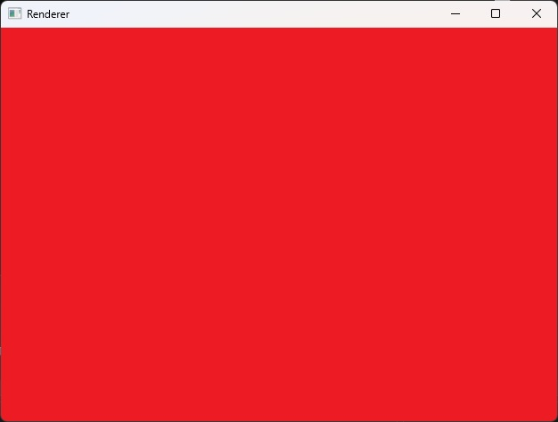
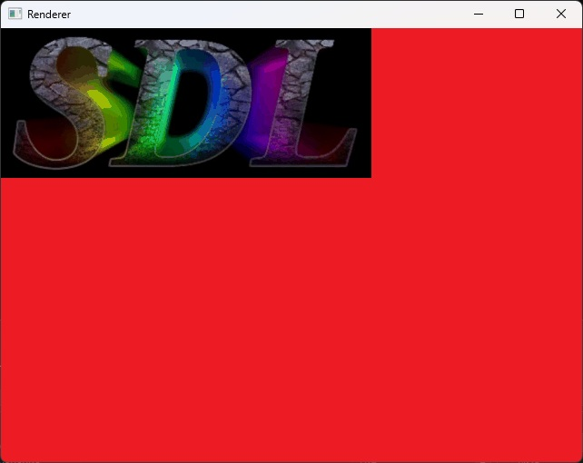
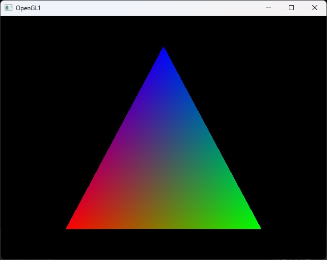

# SDL3Lite - Simple Directmedia Layer Version 3 Lite

[](https://www.boost.org/LICENSE_1_0.txt)
[](https://en.cppreference.com/w/cpp/98)
[]()
[]()

SDL3Lite is a lightweight, highly portable implementation of the SDL3 library API, designed to bring modern SDL3 functionality to legacy systems while maintaining compatibility with both old and new platforms.

## 🎯 **Why SDL3Lite?**

- **Legacy Support**: Works on systems as old as Windows 95 and Debian 3
- **Maximum Portability**: Written in C++98 for compatibility with ancient compilers
- **Minimal Dependencies**: Self-contained implementations reduce external requirements  
- **API Compatibility**: Drop-in replacement for basic SDL3 functionality
- **Dual Rendering**: Support for both OpenGL and software rendering

## ✨ **Features**

### Core Functionality
- ✅ Window management (creation, events, cleanup)
- ✅ OpenGL 1.x - 4.6 support  
- ✅ Software rendering fallback
- ✅ BMP texture loading
- ✅ Basic 2D rendering (rectangles, lines, textures)
- ✅ Event handling system
- ✅ Cross-platform timer support

### Rendering Backends
- **OpenGL 1.2+**: Hardware-accelerated rendering
- **Software**: Pure CPU rendering for systems without OpenGL

## 🏗️ **Quick Start**

### Prerequisites

**Linux:**
```bash
sudo apt-get install libx11-dev libgl1-mesa-dev build-essential cmake
```

**Windows:**
- Visual Studio 2005+ or MinGW
- CMake 3.0+

### Building

```bash
# Clone repository
git clone https://github.com/JordanCpp/SDL3Lite.git
cd SDL3Lite

# Generate build files
cmake -Bout -DCMAKE_BUILD_TYPE=Release

# Build
cd out
make  # Linux
# or
msbuild SDL3Lite.sln  # Windows
```

### Basic Usage

```c
#include <SDL3/SDL.h>

int main() {
    // Initialize SDL
    if (!SDL_Init(SDL_INIT_VIDEO)) {
        printf("SDL Init failed: %s\n", SDL_GetError());
        return 1;
    }
    
    // Create window
    SDL_Window* window = SDL_CreateWindow("Hello SDL3Lite", 
                                         640, 480, 
                                         SDL_WINDOW_OPENGL);
    if (!window) {
        printf("Window creation failed: %s\n", SDL_GetError());
        SDL_Quit();
        return 1;
    }
    
    // Create renderer
    SDL_Renderer* renderer = SDL_CreateRenderer(window, NULL);
    if (!renderer) {
        printf("Renderer creation failed: %s\n", SDL_GetError());
        SDL_DestroyWindow(window);
        SDL_Quit();
        return 1;
    }
    
    // Main loop
    bool running = true;
    while (running) {
        SDL_Event event;
        while (SDL_PollEvent(&event)) {
            if (event.type == SDL_EVENT_QUIT) {
                running = false;
            }
        }
        
        // Clear screen to red
        SDL_SetRenderDrawColor(renderer, 255, 0, 0, 255);
        SDL_RenderClear(renderer);
        SDL_RenderPresent(renderer);
    }
    
    // Cleanup
    SDL_DestroyRenderer(renderer);
    SDL_DestroyWindow(window);
    SDL_Quit();
    return 0;
}
```

## 🖥️ **Platform Support**

| Platform | Status | Minimum Version | Tested |
|----------|--------|----------------|---------|
| Windows | ✅ Supported | Windows 95 | XP, 7, 10, 11 |
| Linux | ✅ Supported | Debian 3 | Ubuntu 14.04+, CentOS 6+ |
| macOS | ❌ Planned | - | - |

## 🔧 **Compiler Support**

| Compiler | Minimum Version | Status |
|----------|----------------|--------|
| Visual C++ | 6.0 | ✅ Supported |
| GCC | 3.0 | ✅ Supported |
| Clang | 3.0 | 🧪 Needs Testing |
| Borland C++ | 5.5 | 🧪 Needs Testing |

## 📚 **API Reference**

### Initialization
```c
bool SDL_Init(Uint32 flags);           // Initialize SDL subsystems
void SDL_Quit(void);                   // Clean up SDL
```

### Window Management  
```c
SDL_Window* SDL_CreateWindow(const char* title, int w, int h, Uint32 flags);
void SDL_DestroyWindow(SDL_Window* window);
```

### Rendering
```c
SDL_Renderer* SDL_CreateRenderer(SDL_Window* window, const char* name);
void SDL_DestroyRenderer(SDL_Renderer* renderer);
void SDL_RenderClear(SDL_Renderer* renderer);
void SDL_RenderPresent(SDL_Renderer* renderer);
```

### Error Handling
```c
const char* SDL_GetError(void);        // Get last error message
```

## 🖼️ **Screenshots**

<details>
<summary>Click to view screenshots</summary>

| Basic Rendering | Textures | OpenGL |
|----------------|----------|---------|
|  |  |  |

</details>

## 🚀 **Examples**

The `examples/` directory contains:
- **Basic Window**: Simple window creation
- **Software Rendering**: CPU-based 2D rendering  
- **OpenGL Triangle**: Hardware-accelerated rendering
- **Texture Loading**: BMP image display
- **Multiple Windows**: Multi-window applications

## 🔨 **CMake Integration**

Add SDL3Lite to your project:

```cmake
# Method 1: Subdirectory
add_subdirectory(SDL3Lite)
target_link_libraries(your_app SDL3)

# Method 2: Find Package (after installation)
find_package(SDL3Lite REQUIRED)
target_link_libraries(your_app SDL3Lite::SDL3)
```

## 🐛 **Known Limitations**

- Audio subsystem not implemented yet
- Limited to basic 2D rendering operations
- No advanced OpenGL features (shaders, FBOs, etc.)
- Single-threaded rendering only
- BMP format only for textures

## 🤝 **Contributing**

1. Fork the repository
2. Create a feature branch (`git checkout -b feature/amazing-feature`)
3. Commit your changes (`git commit -m 'Add amazing feature'`)
4. Push to the branch (`git push origin feature/amazing-feature`)
5. Open a Pull Request

### Development Guidelines
- Maintain C++98 compatibility
- Test on both Windows and Linux
- Add examples for new features
- Follow existing code style
- Update documentation

## 🗺️ **Roadmap**

### v0.1.0 (Current)
- [x] Basic window management
- [x] OpenGL and software rendering
- [x] Event handling
- [x] BMP texture loading

### v0.2.0 (Planned)
- [ ] Audio subsystem
- [ ] Additional image formats (PNG, JPEG)
- [ ] Improved error handling
- [ ] macOS support

### v1.0.0 (Future)
- [ ] Full SDL3 API compatibility
- [ ] Comprehensive test suite
- [ ] Performance optimizations

## 📄 **License**

This project is licensed under the Boost Software License 1.0 - see the [LICENSE](license.txt) file for details.

## 🙏 **Acknowledgments**

- SDL team for the original library design
- Legacy computing community for preservation efforts
- Contributors and testers

## 📞 **Support**

- 📖 [Documentation](wiki) (Coming Soon)
- 🐛 [Issue Tracker](issues)
- 💬 [Discussions](discussions)

---

*"Making modern graphics accessible to vintage systems"*
